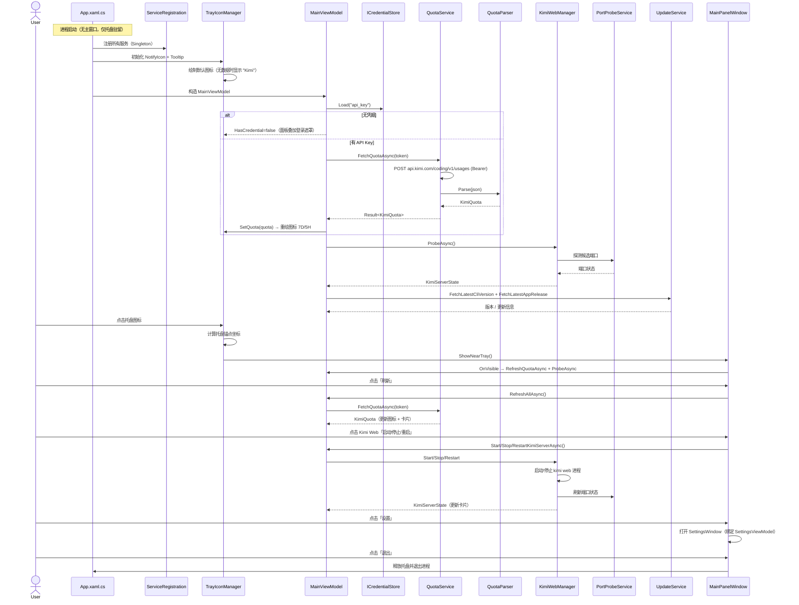
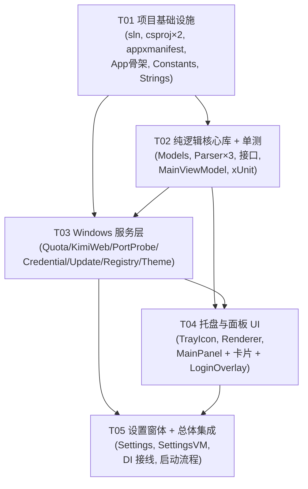

# KimiCodeBar Windows 版 · 系统设计与任务分解

> 架构师：高见远（software-architect）
> 基线：macOS 主线源码（`/Users/getlong/Code/KimiCodeBar/macOS/KimiCodeBar/`）
> 技术栈：**C# 12 + .NET 8 + WinUI 3（Windows App SDK 1.5+）原生实现**
> 范围：Windows v1 仅做核心，1:1 复刻 Mac 主线（不含存档管理 / 技能管理）

---

## Part A：系统设计

### 1. 实现方案与框架选型

#### 1.1 核心难点

| 难点 | Mac 基线做法 | Windows v1 策略 |
|------|-------------|----------------|
| 菜单栏常驻图标 + 文本绘制 | `MenuBarExtra` + `ImageRenderer` 把 `7D/5H` 百分比画成 `NSImage` | `WinUIEx.NotifyIcon` 托盘图标；用 `System.Drawing.Bitmap` 仿 `MenuBarTextRenderer` 绘制 `7D xx% / 5H xx%` 位图 |
| 点击弹出的主面板 | `KimiMenu`（`MenuBarExtra` window 样式） | `MainPanelWindow`（继承 `WinUIEx.WindowEx` 的无边框弹出窗，定位到托盘上方） |
| 用量 API | `KimiCodeBarQuotaService`（纯逻辑） | **零改动移植**到 `QuotaParser` + `QuotaService`（HTTP 层） |
| Kimi Web 常驻 | `LaunchAgent`（plist + launchctl KeepAlive） | 本地**端口探测**判定状态；启动/停止/重启 `kimi web` 进程；开机自启改用**注册表 Run 键** |
| 凭据 / 登录 | `KimiOAuthService`（Device Code Flow） | **v1 不做 OAuth**，改为「填入 API Key」；用 **Windows 凭据管理器（PasswordVault）/ DPAPI** 加密存储 |
| 更新检查 | GitHub Release + 中文 changelog 解析 | **零改动移植** HTTP 逻辑到 `UpdateService` + `ChangelogParser` + `VersionComparer` |
| 多语言 | `LanguageManager`（中/英双语 String Catalog） | v1 **仅中文**；资源字符串集中到 `Strings.resw`，预留扩展 |

#### 1.2 架构模式

- **MVVM（CommunityToolkit.Mvvm）**：`MainViewModel` 为编排中枢，对应 Mac 的 `KimiCodeBarModel`。
- **分层 + 可移植核心库**：抽出一个 **平台无关的 `KimiCodeBar.Core` 类库**（net8.0，纯 C#，不引用任何 WinRT/WinUI），承载所有可单测的纯逻辑（JSON 解析、版本比较、changelog 解析、数据模型、服务接口、编排 ViewModel）。
- **依赖倒置**：Windows 专属实现（HTTP、进程、注册表、凭据、托盘、UI）全部实现 Core 中定义的接口，通过 `ServiceCollection` 注入。这样纯逻辑可在 **macOS 上用 xUnit 跑单测**（.NET 8 运行时跨平台）。

#### 1.3 NuGet 依赖选型

| 包 | 版本 | 用途 | 适用工程 |
|----|------|------|---------|
| `Microsoft.WindowsAppSDK` | `1.5.240428000`（≥1.5） | WinUI 3 运行时/模板 | KimiCodeBar（App） |
| `Microsoft.Windows.SDK.BuildTools` | `10.0.22621.x` | 打包 / WinRT 投影 | KimiCodeBar（App） |
| `WinUIEx` | `2.4.0` | `NotifyIcon` 托盘、`WindowEx` 弹出窗定位 | KimiCodeBar（App） |
| `CommunityToolkit.Mvvm` | `8.2.2` | `ObservableObject` / `[ObservableProperty]` / `IRelayCommand` | Core + App |
| `CommunityToolkit.WinUI` | `8.2.0` | UI 辅助（可选，如 `HeaderedContentControl`、扩展） | KimiCodeBar（App） |
| `Microsoft.Extensions.DependencyInjection` | `8.0.x` | 服务容器 | KimiCodeBar（App） |
| `Microsoft.Extensions.Http` | `8.0.x` | 集中管理 `HttpClient` | KimiCodeBar（App） |
| `System.Drawing.Common` | `8.0.x` | 托盘位图文本绘制（Windows-only，仅 App 用） | KimiCodeBar（App） |
| `xunit` / `xunit.runner.visualstudio` | `2.9.x` | 单元测试（纯逻辑） | KimiCodeBar.Core.Tests |
| `Microsoft.NET.Test.Sdk` | `17.11.x` | 测试 SDK | KimiCodeBar.Core.Tests |

> ⚠️ **本环境为 macOS，无法编译/运行 WinUI 3**（需 Windows 11 + Visual Studio 2022 + Windows App SDK）。本产出是**设计文档 + 任务分解**，工程师在 Windows 上用 VS 构建验证。`KimiCodeBar.Core` 与 `.Tests` 可在 macOS 用 `dotnet test` 直接跑。

---

### 2. 文件列表（全部位于 `Windows/` 下）

```
Windows/
├── KimiCodeBar.sln
├── src/
│   ├── KimiCodeBar.Core/                     # 平台无关纯逻辑（net8.0，可在 macOS 单测）
│   │   ├── KimiCodeBar.Core.csproj
│   │   ├── Constants.cs                      # API 基址 / URL / 候选端口 / 超时
│   │   ├── Exceptions/QuotaError.cs         # 用量查询错误枚举
│   │   ├── Models/
│   │   │   ├── KimiQuota.cs
│   │   │   ├── QuotaDetail.cs
│   │   │   ├── BoosterWallet.cs
│   │   │   ├── KimiServerState.cs
│   │   │   └── AppSettings.cs
│   │   ├── Services/
│   │   │   ├── QuotaParser.cs               # 纯 JSON 解析（零依赖）
│   │   │   ├── VersionComparer.cs           # 纯版本比较
│   │   │   ├── ChangelogParser.cs          # 纯中文 changelog 解析
│   │   │   ├── IQuotaService.cs
│   │   │   ├── IKimiWebManager.cs
│   │   │   ├── ICredentialStore.cs
│   │   │   ├── IUpdateService.cs
│   │   │   └── ILaunchAtLogin.cs
│   │   └── ViewModels/
│   │       └── MainViewModel.cs             # 编排中枢（对应 KimiCodeBarModel）
│   │
│   └── KimiCodeBar/                         # WinUI 3 应用（打包，Windows-only）
│       ├── KimiCodeBar.csproj
│       ├── app.manifest
│       ├── Package.appxmanifest
│       ├── App.xaml
│       ├── App.xaml.cs                       # 入口骨架（T01），DI 接线在 T05 补
│       ├── Host/ServiceRegistration.cs       # T05：ServiceCollection 注册（DI 接线）
│       ├── Assets/
│       │   ├── icon.ico                      # 托盘/任务栏图标
│       │   └── trayTemplate.png
│       ├── Resources/
│       │   └── Strings.resw                 # 集中资源字符串（v1 仅中文，预留英文）
│       ├── Services/                          # Core 接口的 Windows 实现
│       │   ├── QuotaService.cs               # HTTP 调用 + 错误抽取
│       │   ├── KimiWebManager.cs             # 启动/停止/重启 kimi web
│       │   ├── PortProbeService.cs           # 本地端口探测
│       │   ├── WindowsCredentialStore.cs     # PasswordVault 凭据存储
│       │   ├── UpdateService.cs              # GitHub Release + changelog HTTP
│       │   ├── RegistryLaunchAtLogin.cs      # 注册表 Run 键开机自启
│       │   ├── ThemeManager.cs               # 主题（跟随系统/深色/浅色）
│       │   └── ProcessRunner.cs              # 进程启动/停止封装
│       ├── Tray/
│       │   ├── TrayIconManager.cs            # WinUIEx NotifyIcon 封装
│       │   └── TrayIconRenderer.cs          # 绘制 7D/5H 位图（仿 Mac）
│       ├── Views/
│       │   ├── MainPanelWindow.xaml
│       │   ├── MainPanelWindow.xaml.cs      # 主面板（仿 KimiMenu）
│       │   ├── SettingsWindow.xaml
│       │   ├── SettingsWindow.xaml.cs
│       │   ├── Controls/
│       │   │   ├── UsageCard.xaml
│       │   │   ├── UsageCard.xaml.cs
│       │   │   ├── BoosterWalletCard.xaml
│       │   │   ├── BoosterWalletCard.xaml.cs
│       │   │   ├── KimiServerCard.xaml
│       │   │   ├── KimiServerCard.xaml.cs
│       │   │   ├── ActionButton.cs
│       │   │   └── LoginOverlay.cs
│       │   └── Converters/
│       │       └── PercentToWidthConverter.cs
│       └── ViewModels/
│           └── SettingsViewModel.cs
│
└── tests/
    └── KimiCodeBar.Core.Tests/
        ├── KimiCodeBar.Core.Tests.csproj
        ├── QuotaParserTests.cs
        ├── VersionComparerTests.cs
        └── ChangelogParserTests.cs
```

---

### 3. 数据结构与接口

#### 3.1 用量 API 响应 JSON Schema（`POST /coding/v1/usages`）

```json
{
  "$schema": "http://json-schema.org/draft-07/schema#",
  "title": "KimiUsageResponse",
  "type": "object",
  "properties": {
    "usage": {
      "type": "object",
      "description": "周用量（window.duration 不存在/非 300）",
      "properties": {
        "limit":    { "type": "string" },
        "used":     { "type": ["string", "null"] },
        "remaining":{ "type": ["string", "null"] },
        "resetTime":{ "type": ["string", "null"], "description": "ISO8601，含毫秒" }
      }
    },
    "limits": {
      "type": "array",
      "items": {
        "type": "object",
        "properties": {
          "window": { "type": "object", "properties": { "duration": { "type": "integer" } } },
          "detail": {
            "type": "object",
            "properties": {
              "limit":     { "type": ["string", "null"] },
              "used":      { "type": ["string", "null"] },
              "remaining": { "type": ["string", "null"] },
              "resetTime": { "type": ["string", "null"] }
            }
          }
        }
      }
    },
    "totalQuota": {
      "type": "object",
      "properties": {
        "limit":     { "type": ["string", "null"] },
        "remaining": { "type": ["string", "null"] }
      }
    },
    "user": {
      "type": "object",
      "properties": {
        "membership": { "type": "object", "properties": { "level": { "type": ["string", "null"] } } }
      }
    },
    "boosterWallet": {
      "type": ["object", "null"],
      "properties": {
        "status":              { "type": ["string", "null"] },
        "balance": {
          "type": "object",
          "properties": {
            "amount":     { "type": ["string", "null"] },
            "amountLeft": { "type": ["string", "null"], "description": "真实余额，单位 1e-8 元" },
            "unit":       { "type": ["string", "null"] }
          }
        },
        "monthlyChargeLimitEnabled": { "type": "boolean" },
        "monthlyChargeLimit": { "type": "object", "properties": { "currency": {"type":["string","null"]}, "priceInCents": {"type":["string","null"]} } },
        "monthlyUsed":         { "type": "object", "properties": { "currency": {"type":["string","null"]}, "priceInCents": {"type":["string","null"]} } },
        "topupLimit":          { "type": "object", "properties": { "currency": {"type":["string","null"]}, "priceInCents": {"type":["string","null"]} } }
      }
    }
  }
}
```

#### 3.2 类图（Mermaid classDiagram）

```mermaid
classDiagram
    %% ===== 纯逻辑模型（跨平台，Core） =====
    class KimiQuota {
        +QuotaDetail Weekly
        +QuotaDetail FiveHour
        +QuotaDetail TotalQuota
        +string? MembershipLevel
        +BoosterWallet? BoosterWallet
    }
    class QuotaDetail {
        +int Used
        +int Limit
        +int Remaining
        +DateTimeOffset? ResetTime
        +int Percentage
        +string TimeUntilReset()
        +string ResetTimeText()
    }
    class BoosterWallet {
        +string Status
        +bool IsEnabled
        +string Currency
        +double BalanceYuan
        +bool MonthlyChargeLimitEnabled
        +int MonthlyChargeLimitCents
        +int MonthlyUsedCents
        +int TopupLimitCents
        +double MonthlyChargeLimitYuan
        +double MonthlyUsedYuan
        +double TopupLimitYuan
    }
    class KimiServerState {
        <<enum>> Status { Unknown, Running, Stopped, Error }
        +ServerStatus Status
        +string Version
        +int? Port
        +string? Url
    }
    class AppSettings {
        +AppTheme Theme
        +bool LaunchAtLogin
        +string? KimiExecutablePath
        +int KimiWebPort
    }

    %% ===== 纯逻辑解析器（可在 macOS 单测，Core） =====
    class QuotaParser {
        +KimiQuota Parse(ReadOnlySpan~byte~ json)
        -QuotaDetail MakeDetail(string? limit, string? used, string? remaining, string? resetTime)
        -DateTimeOffset? ParseDate(string? s)
    }
    class VersionComparer {
        +int Compare(string a, string b)
        +bool IsNewer(string latest, string current)
        +string Normalize(string v)
    }
    class ChangelogParser {
        +ChangelogEntry? Parse(string text)
        +List~ChangelogEntry~ ParseEntries(string text, int max)
        +string? FetchNotes(string text, string version)
    }
    class ChangelogEntry {
        +string Version
        +string Notes
    }

    %% ===== 服务接口（Core 定义，App 实现） =====
    class IQuotaService {
        <<interface>>
        +Task~Result~KimiQuota,QuotaError~~ FetchQuotaAsync(string token)
    }
    class IKimiWebManager {
        <<interface>>
        +Task StartAsync()
        +Task StopAsync()
        +Task RestartAsync()
        +Task~KimiServerState~ ProbeAsync()
    }
    class ICredentialStore {
        <<interface>>
        +void Save(string key, string secret)
        +string? Load(string key)
        +void Delete(string key)
    }
    class IUpdateService {
        <<interface>>
        +Task~(string?,string?)~ FetchLatestCliVersionAsync()
        +Task~(string?,string?)~ FetchLatestAppReleaseAsync()
        +Task~(string?,string?)~ FetchChangelogAsync()
    }
    class ILaunchAtLogin {
        <<interface>>
        +bool IsEnabled
        +void SetEnabled(bool enabled)
    }

    %% ===== 应用层服务（Windows 专属，App） =====
    class QuotaService {
        -HttpClient _http
        +Task~Result~...~ FetchQuotaAsync(token)
        +static string? ExtractErrorMessage(ReadOnlySpan~byte~ data)
    }
    class KimiWebManager {
        -ProcessRunner _runner
        -PortProbeService _probe
        -string _kimiPath
        +Task StartAsync()
        +Task StopAsync()
        +Task RestartAsync()
        +Task~KimiServerState~ ProbeAsync()
    }
    class PortProbeService {
        +IReadOnlyList~int~ CandidatePorts
        +Task~int?~ ProbeAsync()
    }
    class WindowsCredentialStore {
        -PasswordVault _vault
        +Save() / Load() / Delete()
    }
    class UpdateService {
        -HttpClient _http
        +FetchLatestCliVersionAsync()
        +FetchLatestAppReleaseAsync()
        +FetchChangelogAsync()
    }
    class RegistryLaunchAtLogin {
        -string _runKeyPath
        +IsEnabled / SetEnabled()
    }
    class ThemeManager {
        +AppTheme Theme
        +event ThemeChanged
    }
    class ProcessRunner {
        +Task StartAsync(string file, string args)
        +Task StopTreeAsync(int pid)
    }

    %% ===== 视图模型（编排） =====
    class MainViewModel {
        -IQuotaService _quota
        -IKimiWebManager _web
        -ICredentialStore _cred
        -IUpdateService _update
        +KimiQuota? Quota
        +KimiServerState ServerState
        +bool IsLoading
        +bool HasCredential
        +string KimiVersion
        +string? PendingCliUpdate
        +string? PendingAppUpdate
        +Task RefreshAllAsync()
        +Task RefreshQuotaAsync()
        +Task OpenKimiWebAsync()
        +Task StartKimiServerAsync()
        +Task StopKimiServerAsync()
        +Task RestartKimiServerAsync()
        +Task LoadKimiVersionAsync()
        +Task CheckForUpdatesAsync()
    }
    class SettingsViewModel {
        +string ApiKey
        +AppTheme Theme
        +bool LaunchAtLogin
        +Task SaveAsync()
    }

    %% ===== 托盘 / UI（App） =====
    class TrayIconManager {
        -NotifyIcon _notify
        -TrayIconRenderer _renderer
        +void SetQuota(KimiQuota?)
        +void ShowPanel()
        +event EventHandler PanelRequested
    }
    class TrayIconRenderer {
        +Bitmap Draw(QuotaDetail weekly, QuotaDetail fiveHour)
    }
    class MainPanelWindow
    class SettingsWindow
    class UsageCard
    class BoosterWalletCard
    class KimiServerCard
    class ActionButton
    class LoginOverlay

    %% ===== 关系 =====
    KimiQuota *-- QuotaDetail : Weekly/FiveHour/Total
    KimiQuota *-- BoosterWallet
    QuotaService ..|> IQuotaService
    QuotaService ..> QuotaParser : 调用
    KimiWebManager ..|> IKimiWebManager
    KimiWebManager ..> PortProbeService
    KimiWebManager ..> ProcessRunner
    WindowsCredentialStore ..|> ICredentialStore
    UpdateService ..|> IUpdateService
    UpdateService ..> VersionComparer
    UpdateService ..> ChangelogParser
    RegistryLaunchAtLogin ..|> ILaunchAtLogin
    MainViewModel ..> IQuotaService
    MainViewModel ..> IKimiWebManager
    MainViewModel ..> ICredentialStore
    MainViewModel ..> IUpdateService
    MainViewModel ..> QuotaParser
    SettingsViewModel ..> ICredentialStore
    SettingsViewModel ..> ILaunchAtLogin
    SettingsViewModel ..> ThemeManager
    TrayIconManager ..> TrayIconRenderer
    MainPanelWindow ..> MainViewModel
    MainPanelWindow o-- UsageCard
    MainPanelWindow o-- BoosterWalletCard
    MainPanelWindow o-- KimiServerCard
    MainPanelWindow o-- LoginOverlay
    SettingsWindow ..> SettingsViewModel
```

#### 3.3 关键类说明

| 类 | 工程 | 职责 | 对应 Mac |
|----|------|------|-----------|
| `QuotaParser` | Core | 解析用量 JSON → `KimiQuota`；计算 `percentage`、`timeUntilReset` | `KimiCodeBarQuotaService.parse/makeDetail` |
| `QuotaService` | App | `HttpClient` 调 API，`Bearer` 头，错误抽取 | `KimiCodeBarQuotaService.fetchQuota` |
| `VersionComparer` | Core | `normalizeVersion` + 逐段比较 | `compareVersions` |
| `ChangelogParser` | Core | 解析 `## 版本（日期）` 段 | `parseChineseChangelog` 系列 |
| `KimiWebManager` | App | 启动/停止/重启 `kimi web`，调用端口探测 | `KimiWebLaunchAgentManager` |
| `PortProbeService` | App | 探测候选端口是否响应（判定 Running） | AGENTS.md「本地端口探测」 |
| `WindowsCredentialStore` | App | API Key 存/取/删（凭据管理器） | 替代 `KimiOAuthService` |
| `UpdateService` | App | GitHub Release + changelog HTTP | `fetchLatestGitHubRelease` 等 |
| `RegistryLaunchAtLogin` | App | 注册表 Run 键自启 | `LaunchAtLoginManager`（SMAppService） |
| `MainViewModel` | Core | 状态聚合 + 命令编排 | `KimiCodeBarModel` |
| `TrayIconRenderer` | App | 仿 `MenuBarTextRenderer` 画 `7D xx% / 5H xx%` | `MenuBarTextRenderer` |

---

### 4. 程序调用流程（时序图）



---

### 5. 待明确事项（UNCLEAR）

1. **Kimi Web 默认监听端口未知** ⚠️ 最高优先
   - Mac 源码只写到 `kimi web --no-open --dangerous-bypass-auth`，未硬编码端口。
   - **设计兜底**：`PortProbeService.CandidatePorts` 默认 `[3210, 8080, 8000, 3000, 8888]`，可配置（AppSettings.KimiWebPort）。探测方式：`GET http://127.0.0.1:{port}/` 或 `GET /openapi.json`，任意 2xx/3xx 即判 Running。
   - **需用户在 Windows 上确认**：`kimi web` 实际监听端口（可在浏览器/Fiddler 观察，或用 `netstat -ano | findstr kimi` 看监听端口）。确认后把默认值写进 `Constants.cs`。

2. **`kimi web` Windows 启动命令是否与 Mac 一致** ⚠️
   - 暂按 Mac 一致设计：`kimi web --no-open --dangerous-bypass-auth`（Windows 下 `kimi.exe`）。
   - 需用户确认 Windows 版 CLI 是否支持相同参数；若不同，`KimiWebManager` 的命令模板放到 `Constants.cs` 便于修改，且 kimi 可执行文件名按 `.exe` 探测（`findKimiPath` 移植为 Windows 候选路径 + `where kimi`）。

3. **`kimi` 可执行文件路径（Windows）**
   - 候选：`%USERPROFILE%\.kimi-code\bin\kimi.exe`、`%USERPROFILE%\.kimi\bin\kimi.exe`、`%LOCALAPPDATA%\kimi-code\bin\kimi.exe`、`C:\Program Files\kimi\kimi.exe`、以及 `PATH`（`where kimi`）。

4. **API Key 与用量 API 的 token 关系**
   - Mac 注释明确：API Key（`sk-kimi-` 前缀）或 OAuth token 均以 `Authorization: Bearer` 携带，服务端不区分。v1 仅用 API Key，直接作为 Bearer token 调 `/usages`。✅ 已明确，无需确认。

5. **开机自启实现方式**
   - 采用**注册表 Run 键**（`HKCU\Software\Microsoft\Windows\CurrentVersion\Run`，值为打包后 exe 完整路径）。如需「延迟启动 / 管理员权限」可后续改计划任务，v1 先用注册表。

6. **凭据存储实现**
   - 主选 `Windows.Security.Credentials.PasswordVault`（写入 Windows 凭据管理器，与 CLI 隔离，类比 Mac 的 `KimiCodeBar/credentials.json` 隔离策略）。若打包沙箱限制 PasswordVault，回退 `System.Security.Cryptography.ProtectedData`（DPAPI，用户级）。均通过 `ICredentialStore` 抽象，便于替换与单测。

7. **构建验证**
   - 本机（macOS）仅能 `dotnet test` 跑 `KimiCodeBar.Core.Tests`；**WinUI 应用必须在 Windows + VS2022 构建**。设计文档交付后，由用户在 Windows 上验证。

---

## Part B：任务分解

### 6. 必需 NuGet 包

```
- Microsoft.WindowsAppSDK@1.5.240428000    # WinUI 3 运行时（KimiCodeBar）
- Microsoft.Windows.SDK.BuildTools@10.0.22621.x  # 打包/WinRT（KimiCodeBar）
- WinUIEx@2.4.0                           # NotifyIcon 托盘 + WindowEx（KimiCodeBar）
- CommunityToolkit.Mvvm@8.2.2              # ObservableObject/IRelayCommand（Core + App）
- CommunityToolkit.WinUI@8.2.0            # UI 辅助（KimiCodeBar，可选）
- Microsoft.Extensions.DependencyInjection@8.0.x  # DI 容器（KimiCodeBar）
- Microsoft.Extensions.Http@8.0.x         # HttpClient 工厂（KimiCodeBar）
- System.Drawing.Common@8.0.x             # 托盘位图绘制（KimiCodeBar，Windows-only）
- xunit@2.9.x                             # 单测（KimiCodeBar.Core.Tests）
- xunit.runner.visualstudio@2.9.x         # 测试运行器（KimiCodeBar.Core.Tests）
- Microsoft.NET.Test.Sdk@17.11.x          # 测试 SDK（KimiCodeBar.Core.Tests）
```

### 7. 任务列表（有序、含依赖，按实现顺序）

> 约束：≤5 个任务；首个任务为「项目基础设施」；每个任务 ≥3 个文件；按模块/层次分组。

#### T01 · 项目基础设施（P0，无依赖）
**源文件**：`KimiCodeBar.sln`、`src/KimiCodeBar/KimiCodeBar.csproj`、`src/KimiCodeBar.Core/KimiCodeBar.Core.csproj`、`src/KimiCodeBar/app.manifest`、`src/KimiCodeBar/Package.appxmanifest`、`src/KimiCodeBar/App.xaml`、`src/KimiCodeBar/App.xaml.cs`、`src/KimiCodeBar.Core/Constants.cs`、`src/KimiCodeBar/Resources/Strings.resw`
**说明**：建立解决方案与两个工程；App 工程开启 `<UseWinUI>true</UseWinUI>` 并引用 Windows App SDK/WinUIEx；Core 工程为纯 net8.0（不引用 WinRT）。`Constants.cs` 写入全部跨文件常量（API 基址、`changelog`/GitHub URL、候选端口、超时、User-Agent）。`App.xaml.cs` 仅放最小入口骨架（T05 再补 DI 接线）。`Strings.resw` 集中中文资源字符串。
**依赖**：无 ｜ **优先级**：P0

#### T02 · 纯逻辑核心库 + 单测（P0，依赖 T01）
**源文件**：`src/KimiCodeBar.Core/Models/KimiQuota.cs`、`src/KimiCodeBar.Core/Models/QuotaDetail.cs`、`src/KimiCodeBar.Core/Models/BoosterWallet.cs`、`src/KimiCodeBar.Core/Models/KimiServerState.cs`、`src/KimiCodeBar.Core/Services/QuotaParser.cs`、`src/KimiCodeBar.Core/Services/VersionComparer.cs`、`src/KimiCodeBar.Core/Services/ChangelogParser.cs`、`src/KimiCodeBar.Core/Services/IQuotaService.cs`（及 `IKimiWebManager`/`ICredentialStore`/`IUpdateService`/`ILaunchAtLogin`）、`src/KimiCodeBar.Core/ViewModels/MainViewModel.cs`、`tests/KimiCodeBar.Core.Tests/KimiCodeBar.Core.Tests.csproj`、`tests/KimiCodeBar.Core.Tests/QuotaParserTests.cs`、`tests/KimiCodeBar.Core.Tests/VersionComparerTests.cs`、`tests/KimiCodeBar.Core.Tests/ChangelogParserTests.cs`
**说明**：移植所有可单测纯逻辑（JSON 解析、百分比/重置时间计算、版本比较、中文 changelog 解析），定义服务接口与 `MainViewModel` 编排器。配套 xUnit 用例覆盖 Mac 已知边界（余额单位 1e-8、proto3 缺省布尔、5H 取 `duration==300`、版本 normalize、`## 0.23.5（2026-07-10）` 解析）。**这是 macOS 上唯一能立即跑通验证的部分**。
**依赖**：T01 ｜ **优先级**：P0

#### T03 · Windows 服务层实现（P0，依赖 T01、T02）
**源文件**：`src/KimiCodeBar/Services/QuotaService.cs`、`src/KimiCodeBar/Services/KimiWebManager.cs`、`src/KimiCodeBar/Services/PortProbeService.cs`、`src/KimiCodeBar/Services/WindowsCredentialStore.cs`、`src/KimiCodeBar/Services/UpdateService.cs`、`src/KimiCodeBar/Services/RegistryLaunchAtLogin.cs`、`src/KimiCodeBar/Services/ThemeManager.cs`、`src/KimiCodeBar/Services/ProcessRunner.cs`
**说明**：实现 T02 定义的所有接口。`QuotaService` 用 `HttpClient` 调 API 并复用 `QuotaParser`；`KimiWebManager` 串联 `ProcessRunner` 与 `PortProbeService`；`WindowsCredentialStore` 封装 PasswordVault；`UpdateService` 实现 GitHub/changelog 抓取并复用 `VersionComparer`/`ChangelogParser`；`RegistryLaunchAtLogin` 操作 Run 键；`ThemeManager` 提供主题切换。
**依赖**：T01、T02 ｜ **优先级**：P0

#### T04 · 托盘与面板 UI（P1，依赖 T02、T03）
**源文件**：`src/KimiCodeBar/Tray/TrayIconManager.cs`、`src/KimiCodeBar/Tray/TrayIconRenderer.cs`、`src/KimiCodeBar/Views/MainPanelWindow.xaml`、`src/KimiCodeBar/Views/MainPanelWindow.xaml.cs`、`src/KimiCodeBar/Views/Controls/UsageCard.xaml(.cs)`、`src/KimiCodeBar/Views/Controls/BoosterWalletCard.xaml(.cs)`、`src/KimiCodeBar/Views/Controls/KimiServerCard.xaml(.cs)`、`src/KimiCodeBar/Views/Controls/ActionButton.cs`、`src/KimiCodeBar/Views/Controls/LoginOverlay.cs`、`src/KimiCodeBar/Views/Converters/PercentToWidthConverter.cs`
**说明**：`TrayIconManager` 用 WinUIEx `NotifyIcon` 驻留托盘、悬停 tooltip 显示用量、`PanelRequested` 事件拉起面板；`TrayIconRenderer` 仿 Mac `MenuBarTextRenderer` 用 `System.Drawing.Bitmap` 绘制 `7D xx% / 5H xx%`。`MainPanelWindow` 仿 `KimiMenu`：本周/5小时用量卡 + 加油包卡 + Kimi Web 卡（打开/启动/停止/重启）+ 操作按钮（控制台/刷新/设置/退出）+ CLI 版本行 + 更新行；无凭据时叠加 `LoginOverlay`。所有可点击元素遵循悬停手型光标 + 高亮反馈规范。
**依赖**：T02、T03 ｜ **优先级**：P1

#### T05 · 设置窗体与总体集成（P1，依赖 T03、T04）
**源文件**：`src/KimiCodeBar/Views/SettingsWindow.xaml`、`src/KimiCodeBar/Views/SettingsWindow.xaml.cs`、`src/KimiCodeBar/ViewModels/SettingsViewModel.cs`、`src/KimiCodeBar/Host/ServiceRegistration.cs`（DI 接线）、`src/KimiCodeBar/App.xaml.cs`（补 `ServiceRegistration` 调用与启动流程）
**说明**：`SettingsWindow` 提供 API Key 录入（经 `ICredentialStore` 加密存储）、主题（跟随系统/深色/浅色）、开机自启开关；`SettingsViewModel` 编排保存。`ServiceRegistration` 把所有服务以 Singleton 注册进 `ServiceCollection`，`App.xaml.cs` 启动时构建 `IServiceProvider`、构造 `MainViewModel`、初始化 `TrayIconManager`、触发首次刷新（用量 + Kimi Web 探测 + 更新检查），完成「启动→托盘初始化→首次刷新→面板交互」全链路。
**依赖**：T03、T04 ｜ **优先级**：P1

### 8. 共享知识（跨文件约定）

| 类别 | 约定 |
|------|------|
| **API 基址常量** | `Constants.KimiApiBase = "https://api.kimi.com"`；用量端点 `Constants.UsagesEndpoint = "/coding/v1/usages"`；Header `Authorization: Bearer {token}`；`User-Agent = "KimiCodeBar/1.0"`；超时 30s |
| **URL 常量** | `Constants.ChangelogUrl = "https://moonshotai.github.io/kimi-code/zh/release-notes/changelog.md"`；`Constants.GitHubReleaseApi = "https://api.github.com/repos/xifandev/KimiCodeBar/releases/latest"`；控制台 `https://www.kimi.com/code/console`；Release 页 `https://github.com/xifandev/KimiCodeBar/releases/` |
| **端口探测** | `Constants.CandidatePorts = [3210, 8080, 8000, 3000, 8888]`；`Constants.DefaultKimiWebPort = 3210`（⚠️待 Windows 确认）；探测超时 2s/端口 |
| **配色（仿 Mac，WinUI `ColorHelper.FromArgb(A,R,G,B)`）** | `KimiBlue = #FF3B82F5`；`PanelBgLight = #C7F2F2F7`、`PanelBgDark = #FF0F1421`；`CardBgLight = #E0FCFCFC`、`CardBgDark = #FF1C2436`；`TextPrimaryLight = #FF1F1F1F`、`TextPrimaryDark = #FFFFFFFF`；`TextSecondaryLight = #FF595959`、`TextSecondaryDark = #FF8C8C8C`；`TextTertiaryLight = #FF808080`、`TextTertiaryDark = #FF666666` |
| **命名规范** | 接口前缀 `I`（如 `IQuotaService`）；ViewModel 后缀 `ViewModel`；服务后缀 `Service`/`Manager`；纯逻辑解析器后缀 `Parser`/`Comparer`；Windows 实现与 Core 接口同名但放在 `KimiCodeBar/Services`；公共 API 用 `async Task` + `Result<T, TError>` 或 `(T? value, string? error)` 元组 |
| **错误处理** | 网络/HTTP/解析错误统一走 `QuotaError` 枚举 + `ExtractErrorMessage`（兼容 `error`/`message`/`detail` 字段）；UI 层仅展示友好中文，详细错误写调试日志；token 为空直接 `.invalidKeyFormat` |
| **i18n 占位** | 所有用户可见文案走 `Strings.resw` 的 key（v1 仅中文值），禁止硬编码；品牌名（Kimi / KimiCodeBar / Kimi Web）、`7D`/`5H` 标注不本地化 |
| **可测试性** | 纯逻辑（`QuotaParser`/`VersionComparer`/`ChangelogParser`/`MainViewModel`）不得引用 WinRT/WinUI；Windows 专属依赖一律经接口注入，便于在 macOS 用 xUnit 验证 |
| **资源字符串文件** | 单一 `Strings.resw`，`ResourceLoader` 读取；新增文案同步补 key |

### 9. 任务依赖图（Mermaid graph）


